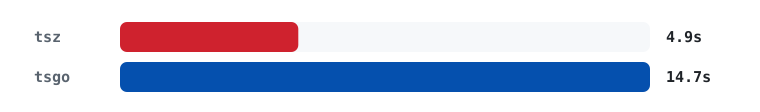

<br>
<br>

<p align="center">
	<picture>
		<source media="(prefers-color-scheme: dark)" srcset="crates/tsz-website/static/tsz_logo_dark.png">
		<source media="(prefers-color-scheme: light)" srcset="crates/tsz-website/static/tsz_logo_light.png">
		
	</picture>
</p>

<br>
<br>


`tsz` is a performance-first TypeScript compiler in Rust. _z_ is for _Zang_!<sup>[1](#footnote-1)</sup>
The goal is a correct, fast, drop-in replacement for `tsc`, with both native and WASM targets.

`tsz` is built the with help of AI-assistant coding. Many tools and AI models were used during its development.

## Performance

`tsz` is aiming to be 2x faster than tsgo on all benchmarks. It is 3x faster in small file samples. Work on larger projects is underway.
<!-- PERFORMANCE_START -->
<p align="left">
  <a href="https://tsz.dev/benchmarks/">
    <picture>
      <source media="(prefers-color-scheme: dark)" srcset="crates/tsz-website/static/benchmark-data/readme-perf-dark.png">
      <source media="(prefers-color-scheme: light)" srcset="crates/tsz-website/static/benchmark-data/readme-perf-light.png">
      
    </picture>
  </a>
</p>
<!-- PERFORMANCE_END -->

## Install

> [!WARNING]
> `tsz` is pre-release software and not yet a drop-in replacement for `tsc`.
> Diagnostics, inference, and emit may differ from TypeScript today. Use for
> experimentation only.

**macOS & Linux**

```sh
curl -fsSL https://tsz.dev/install | sh
```

**Windows (PowerShell)**

```powershell
irm https://tsz.dev/install.ps1 | iex
```

## TypeScript compatibility

`tsz` runs TypeScript's own test suite for compatablity across type-checking, code emition and LSP. 
<!-- TS_VERSION_START -->
Currently targeting `TypeScript`@`6.0.3`
<!-- TS_VERSION_END -->
### Type Checker

To ensure tsz is a drop-in replacement for `tsc`, we run the official TypeScript conformance
test suite against it.


<!-- CONFORMANCE_START -->
```
Progress: [████████████████████] 100.0% (12,579/12,585 tests)
```
<!-- CONFORMANCE_END -->


### Emitter


<!-- EMIT_START -->
```
JavaScript:  [████████████████████] 99.2% (13,426 / 13,530 tests)
Declaration: [████████████████████] 98.4% (1,642 / 1,669 tests)
```
<!-- EMIT_END -->

### Language Service

<!-- FOURSLASH_START -->
```
Progress: [████████████████████] 99.9% (6,558 / 6,562 tests)
```
<!-- FOURSLASH_END -->


<a id="footnote-1">1</a>: "Zang" is the Persian word for "rust".
