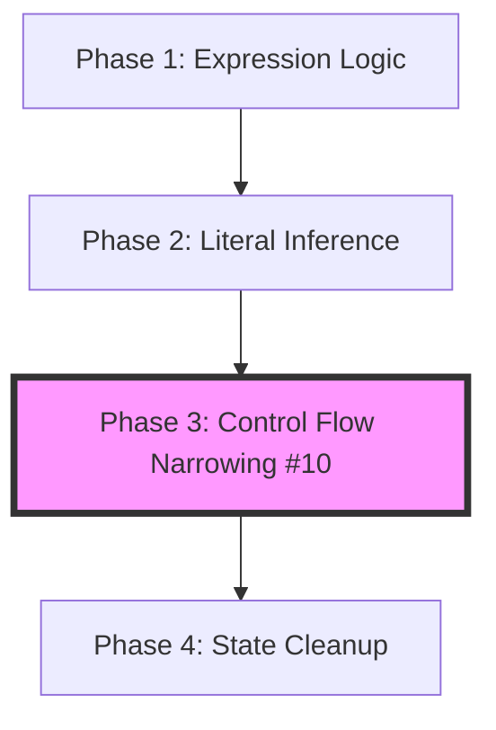

# Solver-First Migration Action Plan

**Generated**: February 2, 2026
**Status**: Ready for Execution
**Related Todos**: #08 (Solver-First Architecture), #10 (Narrowing to Solver)

---

## Executive Summary

This document consolidates architectural analysis, risk assessment, API design, and implementation strategy for migrating type computation logic from the Checker to the Solver. This is a **high-severity architectural refactor** that moves critical type operations (inference, narrowing, expression math) from the AST-bound Checker to the pure-algebra Solver.

**Key Insight**: Task #10 is a detailed specification for Phase 3 of Task #08. They should be executed sequentially, not in parallel.

**Timeline**: 5-10 days of focused work (1-2 hours/day)
**Risk Level**: High (touches core inference and control flow)

---

## Table of Contents

1. [Architecture & Dependencies](#1-architecture--dependencies)
2. [Risk Assessment](#2-risk-assessment)
3. [Complete API Design](#3-complete-api-design)
4. [Testing Strategy](#4-testing-strategy)
5. [Code Organization](#5-code-organization)
6. [Implementation Steps](#6-implementation-steps)
7. [Edge Cases](#7-edge-cases)
8. [Performance Analysis](#8-performance-analysis)
9. [Success Criteria](#9-success-criteria)
10. [Day-by-Day Execution Plan](#10-day-by-day-execution-plan)

---

## 1. Architecture & Dependencies

### Relationship Between #08 and #10

**Task #10 is Phase 3 of Task #08.**

- **#08 (Epic)**: Move ALL type computation to Solver
  - Phase 1: Expression Logic (conditionals, templates)
  - Phase 2: Literal Inference (arrays, objects, BCT)
  - **Phase 3: Control Flow Narrowing** ← #10 is this
  - Phase 4: State Cleanup

- **#10 (Detailed Spec)**: Narrowing implementation details
  - Provides concrete `TypeGuard` enum design
  - Specifies narrowing API surface
  - More detailed than #08's Phase 3 summary

### Optimal Execution Order



**Why Sequential?**
1. Establish patterns with simpler logic (Phase 1) before complex narrowing (Phase 3)
2. Both expand Solver API surface - doing together creates merge conflicts
3. Phase 1 validates the "Checker delegates to Solver" pattern safely

### Shared Components

| Component | #08 Role | #10 Role |
|-----------|----------|----------|
| `src/solver/narrowing.rs` | Proposed creation | Defines `TypeGuard` enum |
| `src/checker/control_flow.rs` | Target for refactor | Detailed refactoring plan |
| `src/checker/flow_narrowing.rs` | Implicit deletion target | Explicit deletion target |

---

## 2. Risk Assessment

### Risk Matrix

| Phase | Risk Level | What Could Go Wrong | Rollback Strategy |
|-------|-----------|---------------------|-------------------|
| **Phase 1: Expressions** | 🟢 Low | Template literal union overflow | Git revert |
| **Phase 2: Inference** | 🔴 High | BCT algorithm breaks array typing | Keep old logic, shadow comparison |
| **Phase 3: Narrowing** | 🔴 High | Negation logic for else branches fails | Parallel implementation, compare results |
| **Phase 4: Cleanup** | 🟢 Low | Accidental deletion of edge cases | Git revert |

### High-Risk Scenarios & Mitigation

#### Scenario 1: BCT Inference Regression
- **Probability**: High
- **Impact**: Critical (breaks almost every array in codebase)
- **Mitigation**: Shadow Testing
  ```rust
  // In Checker during migration
  let old_result = self.old_bct_logic(elements);
  let new_result = self.solver.infer_array_literal_type(elements);
  assert_eq!(old_result, new_result, "BCT mismatch");
  ```

#### Scenario 2: Freshness/Excess Property Failure
- **Probability**: Medium
- **Impact**: High (silent excess property check failures)
- **Mitigation**: Add unit tests verifying `TypeFlags::IS_FRESH` is preserved

#### Scenario 3: Narrowing "Else" Branch Logic
- **Probability**: High
- **Impact**: High (set difference is mathematically complex)
- **Mitigation**: Implement `narrow_type_exclude` with extensive unit tests
  ```rust
  // Test: (A | B) - A = B
  let ab = union(a, b);
  let result = solver.narrow_type_exclude(ab, a);
  assert_eq!(result, b);
  ```

#### Scenario 4: Performance Regression
- **Probability**: Medium
- **Impact**: Medium
- **Mitigation**: Use tracer.rs to measure type instantiation counts

### Rollback Strategy

1. **Atomic Commits**: Never merge Phase 2 and Phase 3 in same PR
2. **Parallel Implementation**: Keep old code marked `#[deprecated]` until verified
3. **Conformance Baseline**: Run and save output before starting

---

## 3. Complete API Design

### 3.1 Inference API (`src/solver/inference.rs`)

```rust
use crate::solver::types::TypeId;
use crate::interner::Atom;

/// Property in an object literal, AST-agnostic
#[derive(Debug, Clone)]
pub struct ObjectLiteralProperty {
    pub name: Atom,
    pub type_id: TypeId,
    pub kind: PropertyKind,
}

#[derive(Debug, Clone, Copy, PartialEq, Eq)]
pub enum PropertyKind {
    Simple,     // key: value
    Getter,     // get key() { ... }
    Setter,     // set key(v) { ... }
    Spread,     // ...value
}

impl<'a> Solver<'a> {
    /// Infers type of array literal [e1, e2, ...]
    /// Handles Best Common Type (BCT) and tuple inference
    pub fn infer_array_literal_type(
        &self,
        elements: &[TypeId],
        contextual_type: Option<TypeId>
    ) -> TypeId;

    /// Infers type of object literal { p1: v1, ... }
    /// Handles property collection, spread, freshness marking
    pub fn infer_object_literal_type(
        &self,
        properties: &[ObjectLiteralProperty],
        contextual_type: Option<TypeId>
    ) -> TypeId;

    /// Widens literal to primitive: "foo" -> string
    pub fn widen_literal_type(&self, type_id: TypeId) -> TypeId;

    /// Computes Best Common Type for array inference
    pub fn compute_best_common_type(&self, candidates: &[TypeId]) -> TypeId;
}
```

### 3.2 Narrowing API (`src/solver/narrowing.rs`)

```rust
use crate::solver::types::TypeId;
use crate::interner::Atom;

/// Represents a condition that narrows a type
/// AST-agnostic: Uses Atoms, TypeIds, Enums (not NodeIndex)
#[derive(Debug, Clone, PartialEq)]
pub enum TypeGuard {
    /// typeof x === "typename"
    Typeof(Atom),

    /// x instanceof Class
    Instanceof(TypeId),

    /// x === value or x !== value
    LiteralEquality(TypeId),

    /// x == null or x != null (checks null and undefined)
    NullishEquality,

    /// x (truthiness check)
    Truthy,

    /// x.prop === value (Discriminated Union)
    Discriminant {
        property_name: Atom,
        value_type: TypeId,
    },

    /// prop in x
    InProperty(Atom),
}

impl<'a> Solver<'a> {
    /// Narrows a type based on a guard
    /// Returns NEVER if guard proves path is impossible
    /// Returns source if guard doesn't apply
    pub fn narrow_type(
        &self,
        source: TypeId,
        guard: &TypeGuard,
        is_true_branch: bool
    ) -> TypeId;

    /// Helper: Remove specific type from union
    /// Used for else branches and inequality checks
    pub fn narrow_type_exclude(&self, source: TypeId, type_to_exclude: TypeId) -> TypeId;
}
```

### 3.3 Operations API (`src/solver/operations.rs`)

```rust
use crate::solver::types::TypeId;

/// AST-agnostic binary operator
#[derive(Debug, Clone, Copy, PartialEq, Eq)]
pub enum BinaryOp {
    Add, Subtract, Multiply, Divide, Modulo,
    BitwiseAnd, BitwiseOr, BitwiseXor,
    LeftShift, RightShift, UnsignedRightShift,
    LessThan, GreaterThan, LessThanEqual, GreaterThanEqual,
    Equals, NotEquals, StrictEquals, StrictNotEquals,
    In, Instanceof,
}

impl<'a> Solver<'a> {
    /// Computes result of conditional expression: cond ? true_expr : false_expr
    /// - If cond is truthy: return true_type
    /// - If cond is falsy: return false_type
    /// - Otherwise: return Union(true_type, false_type)
    pub fn compute_conditional_expression_type(
        &self,
        condition_type: TypeId,
        true_type: TypeId,
        false_type: TypeId
    ) -> TypeId;

    /// Computes type of template literal: `prefix${A}suffix${B}...`
    /// - Returns Literal(String) if all parts are literals
    /// - Returns TemplateLiteral type if unions/generics
    /// - Returns Intrinsic(String) if too complex
    pub fn compute_template_literal_type(&self, parts: &[TypeId]) -> TypeId;

    /// Computes result of binary arithmetic/logical operation
    /// e.g., number + number -> number, string + number -> string
    pub fn compute_binary_expression_type(
        &self,
        left: TypeId,
        right: TypeId,
        operator: BinaryOp
    ) -> TypeId;
}
```

### Error Handling Strategy

The Solver API is **total** (always returns TypeId) for compiler error tolerance:

1. **Invalid Operations**: Return `TypeId::ERROR` or `TypeId::ANY`
2. **Impossible Narrowing**: Return `TypeId::NEVER`
3. **Complexity Limits**: Return simplified type or `TypeId::ERROR`
4. **Internal Failures**: Unwrap to valid TypeId (ERROR or ANY)

---

### 4. Error Handling Considerations (GEMINI REVIEW FEEDBACK)

**Issue**: The plan focuses on returning `TypeId`, but Checker needs diagnostic context for error reporting.

**Current Approach** (Phase 1):
- Solver returns `TypeId::ERROR` or `TypeId::NEVER`
- Checker uses side-channel or AST correlation for diagnostics
- **Simpler to implement** - validates the architecture first

**Future Enhancement** (Phase 2+ if needed):
- Consider `Result<TypeId, InferenceError>` for better diagnostics
- Add correlation IDs to `ObjectLiteralProperty` for error mapping
- Enables precise error messages without side-channels

**Decision**: Start with simple approach (return TypeId), enhance if Phase 1 reveals diagnostic limitations.

---

### 5. Boolean Logic Normalization (GEMINI REVIEW FEEDBACK)

**Critical Addition for Phase 4**:

The plan underestimates `extract_type_guard` complexity. TypeScript allows:
```typescript
if (isString(x) && x.length > 5 || x === "foo")
```

**Required Sub-task** (Phase 4, Day 3):
- Implement boolean expression normalization in Checker
- Flatten complex boolean logic using De Morgan's laws
- Convert `!(typeof x !== 'string')` to positive `typeof x === 'string'`
- Ensure Solver receives atomic `TypeGuard`s, not complex expressions

**Step 24.5** (New): Implement boolean expression normalizer
- Files: `src/checker/control_flow.rs`
- Logic: Normalize AND/OR/NOT before `extract_type_guard`
- Tests: Unit tests for complex guard extraction

---

### 6. Property-Based Testing (GEMINI REVIEW FEEDBACK)

**Addition to Testing Strategy**:

Since `narrowing.rs` is pure set algebra, it's perfect for property-based testing.

**Recommended** (Phase 2, Day 2):
- Add `proptest` crate for narrowing module
- Test set theoretic invariants:
  - Commutativity: `A ∩ B = B ∩ A`
  - Associativity: `(A ∩ B) ∩ C = A ∩ (B ∩ C)`
  - Identity: `A ∩ Universal = A`
- Catches edge cases unit tests miss

**Implementation** (Optional but Recommended):
```rust
#[proptest]
fn test_narrow_intersection_commutative(a: TypeId, b: TypeId) {
    let ab1 = solver.narrow_intersection(a, b);
    let ab2 = solver.narrow_intersection(b, a);
    assert_eq!(ab1, ab2);
}
```

---

### 7. Shadow Testing Performance (GEMINI REVIEW FEEDBACK)

**Risk Mitigation Update**:

Shadow testing (running old + new logic) doubles type-checking work.

**Required Fix**:
- Add `#[cfg(debug_assertions)]` gate to shadow testing code
- Never ship shadow testing in release builds
- Add compiler flag or feature flag to enable

**Example**:
```rust
#[cfg(debug_assertions)]
let shadow_result = self.old_bct_logic(elements);
assert_eq!(shadow_result, new_result, "BCT mismatch");
```

---

## 4. Testing Strategy

### 4.1 Unit Tests (Pure Solver Logic)

#### Location
`src/solver/tests/inference_tests.rs`
`src/solver/tests/operations_tests.rs`
`src/solver/tests/narrowing_tests.rs`

#### Test Categories

**Array Literal Inference (BCT)**
```rust
#[test]
fn test_infer_array_literal_bct() {
    let mut solver = Solver::default();
    let str_type = solver.intern_string();
    let num_type = solver.intern_number();

    // [string, number] -> (string | number)[]
    let elements = vec![str_type, num_type];
    let result = solver.infer_array_literal_type(&elements, None);

    let union_type = solver.intern_union(&[str_type, num_type]);
    let expected = solver.intern_array(union_type);
    assert_eq!(result, expected);
}
```

**Conditional Expressions**
- `boolean ? string : number` -> `string | number`
- `true ? string : number` -> `string` (constant folding)
- `boolean ? (boolean ? A : B) : C` -> `A | B | C`

**Template Literals**
- `` `a${string}b` `` -> TemplateLiteralType
- `` `color-${'red' | 'blue'}` `` -> `"color-red" | "color-blue"`

**Narrowing**
```rust
#[test]
fn test_narrow_discriminated_union() {
    let mut solver = Solver::default();
    let union_type = solver.intern_union(&[obj_a, obj_b]);

    let guard = TypeGuard::Discriminant {
        property_name: solver.intern_atom("kind"),
        value_type: literal_a_type,
    };

    // True branch
    let narrowed = solver.narrow_type(union_type, &guard, true);
    assert_eq!(narrowed, obj_a);

    // False branch (negation)
    let else_branch = solver.narrow_type(union_type, &guard, false);
    assert_eq!(else_branch, obj_b);
}
```

### 4.2 Integration Tests (Checker -> Solver Handoff)

#### Location
`src/checker/tests/` (using existing test infrastructure)

**Example for Narrowing Integration**
```rust
#[test]
fn test_checker_extracts_typeof_guard() {
    let code = r#"
        function f(x: string | number) {
            if (typeof x === 'string') {
                x; // @assertType string
            } else {
                x; // @assertType number
            }
        }
    "#;
    run_checker_test(code);
}
```

### 4.3 Regression Testing (Conformance)

**Baseline**: Run before starting to see current pass rate
**Verification**: Run same subset after each phase

```bash
# Specific relevant subsets (faster than all)
./scripts/conformance/run.sh --server --pattern "conformance/types/typeRelationships"
./scripts/conformance/run.sh --server --pattern "conformance/controlFlow"
./scripts/conformance/run.sh --server --pattern "conformance/expressions"
```

### 4.4 Golden Tests / Snapshots

**Decision**: No new proprietary snapshots needed
**Reason**: TypeScript conformance suite acts as the "Golden" dataset
**Exception**: If edge case not covered by TS conformance, add to `tests/cases/local/`

### 4.5 Execution Order During Development

**TDD Loop for each sub-feature:**

1. Write Solver Unit Test (will fail - API doesn't exist)
2. Implement Solver Logic
3. Pass Unit Test
4. Refactor Checker to use Solver API
5. Run Conformance Subset
6. Fix Regressions
7. Commit

---

## 5. Code Organization

### File Structure Overview

```text
src/
├── solver/
│   ├── mod.rs                 # Export new modules
│   ├── inference.rs           # [NEW] Type inference (BCT, Widening)
│   ├── narrowing.rs           # [NEW] Control flow set algebra
│   ├── operations.rs          # [EXPAND] Expression math
│   └── ...
├── checker/
│   ├── type_computation.rs    # [DELETE] Logic moved to solver
│   ├── flow_narrowing.rs      # [DELETE] Logic moved to solver
│   ├── control_flow.rs        # [MODIFY] Extract guards, call solver
│   ├── state.rs               # [MODIFY] Calls solver::inference
│   └── ...
```

### Module Responsibilities

#### `src/solver/inference.rs` (New)
**Responsibility**: Synthesize types from values/collections

**Key Types**:
- `ObjectLiteralProperty { name, type_id, kind }`

**Key Functions**:
- `infer_array_literal_type(elements)` - Best Common Type
- `infer_object_literal_type(props)` - Shape construction
- `widen_literal_type(type_id)` - Literal -> Primitive

#### `src/solver/narrowing.rs` (New)
**Responsibility**: Set-theoretic operations for control flow

**Key Types**:
- `TypeGuard { Typeof, Instanceof, Literal, Truthy, Discriminant, ... }`

**Key Functions**:
- `narrow_type(source, guard, sense)` - Main narrowing API
- `narrow_type_exclude(source, exclude)` - Union subtraction

#### `src/solver/operations.rs` (Expanded)
**Responsibility**: Type math for expressions

**Key Functions**:
- `compute_conditional_result(true, false)` - Ternary types
- `compute_template_expression(parts)` - Template types
- `compute_binary_expression(left, right, op)` - Operator types

#### `src/checker/control_flow.rs` (Modified)
**Responsibility**: AST traversal and Guard Extraction

**Key Changes**:
- Remove all type manipulation logic
- Add `extract_type_guard(node) -> Option<TypeGuard>`
- Call `self.solver.narrow_type(...)`

### Dependency Management (Avoid Circular Dependencies)

**Rules:**

1. **Solver is Leaf**: Never import from `checker` or depend on `NodeIndex`/`SyntaxKind`
2. **Shared Types in Solver**: `TypeGuard`, `ObjectLiteralProperty` defined in Solver
3. **Checker Depends on Solver**: Checker imports Solver types to construct requests

**Good (Linear):**
```rust
// solver/narrowing.rs defines
pub enum TypeGuard { ... }

// checker/control_flow.rs imports
use crate::solver::narrowing::TypeGuard;
```

**Bad (Circular):**
```rust
// solver/narrowing.rs imports
use crate::checker::control_flow::TypeGuard; // WRONG!
```

### Migration Steps

1. **Create Solver Modules**: Add `inference.rs`, `narrowing.rs` to `solver/mod.rs`
2. **Move Logic**: Copy from Checker, adapt to use TypeId only
3. **Refactor Checker**: Update to call Solver APIs
4. **Cleanup**: Delete `type_computation.rs`, `flow_narrowing.rs`

---

## 6. Implementation Steps

### Phase 1: Expression Logic Migration
*Goal: Move simple type algebra for expressions*

**Step 1**: Create `src/solver/operations.rs` and expose in `mod.rs`
- Files: `src/solver/operations.rs`, `src/solver/mod.rs`
- Verify: `cargo build` passes

**Step 2**: Implement `compute_conditional_result(true_type, false_type)`
- Files: `src/solver/operations.rs`, `src/solver/tests/operations_tests.rs`
- Verify: `cargo nextest run operations_tests`

**Step 3**: Migrate conditional expression checking
- Files: `src/checker/expr.rs` or `type_computation.rs`
- Verify: `./scripts/conformance/run.sh` (no regressions)

**Step 4**: Implement `compute_template_expression(parts)`
- Files: `src/solver/operations.rs`, `src/solver/tests/operations_tests.rs`
- Verify: `cargo nextest run operations_tests`

**Step 5**: Migrate template expression checking
- Files: `src/checker/expr.rs`
- Verify: `./scripts/conformance/run.sh`

### Phase 2: Literal Inference Migration
*Goal: Move complex inference (Arrays, Objects) to Solver*

**Step 6**: Create `src/solver/inference.rs`
- Files: `src/solver/inference.rs`, `src/solver/mod.rs`
- Verify: `cargo build` passes

**Step 7**: Implement `widen_literal_type(type_id)`
- Files: `src/solver/inference.rs`, `src/solver/tests/inference_tests.rs`
- Verify: `cargo nextest run inference_tests`

**Step 8**: Migrate literal widening usage
- Files: `src/checker/state.rs`, `src/checker/declarations.rs`
- Verify: `./scripts/conformance/run.sh`

**Step 9**: Implement `infer_array_literal_type(elements)`
- Files: `src/solver/inference.rs`, `src/solver/tests/inference_tests.rs`
- Verify: `cargo nextest run inference_tests`

**Step 10**: Migrate array literal checking
- Files: `src/checker/expr.rs`
- Verify: `./scripts/conformance/run.sh`

**Step 11**: Define `ObjectLiteralProperty` struct
- Files: `src/solver/inference.rs`
- Verify: `cargo build`

**Step 12**: Implement basic object inference (no spread/getters)
- Files: `src/solver/inference.rs`, `src/solver/tests/inference_tests.rs`
- Verify: `cargo nextest run inference_tests`

**Step 13**: Implement object spread inference
- Files: `src/solver/inference.rs`, `src/solver/tests/inference_tests.rs`
- Verify: `cargo nextest run inference_tests`

**Step 14**: Implement freshness logic
- Files: `src/solver/inference.rs`
- Verify: `cargo nextest run inference_tests`

**Step 15**: Migrate object literal checking
- Files: `src/checker/expr.rs`
- Verify: `./scripts/conformance/run.sh`

### Phase 3: Narrowing Foundation
*Goal: Implement pure set algebra in Solver*

**Step 16**: Create `src/solver/narrowing.rs` and `TypeGuard` enum
- Files: `src/solver/narrowing.rs`, `src/solver/mod.rs`
- Verify: `cargo build`

**Step 17**: Implement `narrow_by_typeof(type, typename)`
- Files: `src/solver/narrowing.rs`, `src/solver/tests/narrowing_tests.rs`
- Verify: `cargo nextest run narrowing_tests`

**Step 18**: Implement `narrow_by_equality(type, value_type, is_equal)`
- Files: `src/solver/narrowing.rs`, `src/solver/tests/narrowing_tests.rs`
- Verify: `cargo nextest run narrowing_tests`

**Step 19**: Implement `narrow_by_truthiness(type, is_truthy)`
- Files: `src/solver/narrowing.rs`, `src/solver/tests/narrowing_tests.rs`
- Verify: `cargo nextest run narrowing_tests`

**Step 20**: Implement `narrow_by_discriminant(type, key, value)`
- Files: `src/solver/narrowing.rs`, `src/solver/tests/narrowing_tests.rs`
- Verify: `cargo nextest run narrowing_tests`

**Step 21**: Implement `narrow_by_instanceof(type, class_type)`
- Files: `src/solver/narrowing.rs`, `src/solver/tests/narrowing_tests.rs`
- Verify: `cargo nextest run narrowing_tests`

**Step 22**: Implement `narrow_by_in_property(type, prop_name)`
- Files: `src/solver/narrowing.rs`, `src/solver/tests/narrowing_tests.rs`
- Verify: `cargo nextest run narrowing_tests`

**Step 23**: Expose main `narrow_type(type, guard, sense)` API
- Files: `src/solver/narrowing.rs`
- Verify: `cargo build`

### Phase 4: Narrowing Integration
*Goal: Connect Checker AST traversal to Solver*

**Step 24**: Implement `extract_type_guard` for typeof
- Files: `src/checker/control_flow.rs`
- Verify: Unit test in `control_flow.rs`

**Step 25**: Switch typeof narrowing to use Solver
- Files: `src/checker/control_flow.rs`
- Verify: `./scripts/conformance/run.sh`

**Step 26**: Implement guard extractor for equality
- Files: `src/checker/control_flow.rs`
- Verify: Unit test in `control_flow.rs`

**Step 27**: Switch equality narrowing to use Solver
- Files: `src/checker/control_flow.rs`
- Verify: `./scripts/conformance/run.sh`

**Step 28**: Implement guard extractor for truthiness
- Files: `src/checker/control_flow.rs`
- Verify: Unit test in `control_flow.rs`

**Step 29**: Switch truthiness narrowing to use Solver
- Files: `src/checker/control_flow.rs`
- Verify: `./scripts/conformance/run.sh`

**Step 30**: Implement guard extractor for instanceof
- Files: `src/checker/control_flow.rs`
- Verify: Unit test in `control_flow.rs`

**Step 31**: Switch instanceof narrowing to use Solver
- Files: `src/checker/control_flow.rs`
- Verify: `./scripts/conformance/run.sh`

**Step 32**: Implement guard extractor for `in` operator
- Files: `src/checker/control_flow.rs`
- Verify: Unit test in `control_flow.rs`

**Step 33**: Switch in-operator narrowing to use Solver
- Files: `src/checker/control_flow.rs`
- Verify: `./scripts/conformance/run.sh`

**Step 34**: Implement guard extractor for discriminants
- Files: `src/checker/control_flow.rs`
- Verify: Unit test in `control_flow.rs`

**Step 35**: Switch discriminant narrowing to use Solver
- Files: `src/checker/control_flow.rs`
- Verify: `./scripts/conformance/run.sh`

### Phase 5: Cleanup & Verification
*Goal: Remove legacy code, enforce architecture*

**Step 36**: Delete `src/checker/flow_narrowing.rs`
- Files: `src/checker/flow_narrowing.rs`, `src/checker/mod.rs`
- Verify: `cargo build`

**Step 37**: Delete `src/checker/type_computation.rs`
- Files: `src/checker/type_computation.rs`, `src/checker/mod.rs`
- Verify: `cargo build`

**Step 38**: Extract dispatcher from `checker/state.rs`
- Files: `src/checker/dispatch.rs`, `src/checker/state.rs`
- Verify: `cargo build`

**Step 39**: Enforce visitor pattern in checker
- Files: `src/checker/**/*.rs`
- Verify: `grep "TypeKey::" src/checker/` returns empty

**Step 40**: Final verification
- Verify: `./scripts/conformance/run.sh --all`

---

## 7. Edge Cases

### Expression Logic

#### Conditional Expressions
| Edge Case | Scenario | Expected Behavior |
|-----------|----------|-------------------|
| Condition is Literal | `true ? number : string` | Return `number` (not union) |
| Condition is `any` | `any ? A : B` | Return `A \| B` |
| Condition is `never` | `never ? A : B` | Return `never` (unreachable) |
| Branch is `never` | `bool ? A : never` | Return `A` (union with never vanishes) |
| Recursive Types | `cond ? T : T[]` | Handle without stack overflow |

#### Template Literals
| Edge Case | Scenario | Expected Behavior |
|-----------|----------|-------------------|
| Input is `any` | `` `val: ${any}` `` | Return `string` |
| Input is `never` | `` `val: ${never}` `` | Return `never` |
| Input is Union | `` `val: ${'a' \| 'b'}` `` | Return `"val: a" \| "val: b"` |
| Explosive Union | Union size > 100,000 | Fallback to `string` (Rule #22) |
| Input is Symbol | `` `${Symbol()}` `` | Error: Symbols can't be in templates |

### Literal Inference

#### Array Literals
| Edge Case | Scenario | Expected Behavior |
|-----------|----------|-------------------|
| Empty Array | `[]` | Return `any[]` (implicit any) |
| Heterogeneous | `[1, "a"]` | Return `(number \| string)[]` (Rule #32) |
| With `never` | `[1, never]` | Return `number[]` (never filtered) |
| With `any` | `[1, any]` | Return `any[]` (any pollutes) |
| Circular Ref | `const a = []; a.push(a);` | Handle gracefully (return `any[]`) |
| Widening | `const x = ["a"]` | Widen to `string[]` for `let/var` (Rule #10) |

#### Object Literals
| Edge Case | Scenario | Expected Behavior |
|-----------|----------|-------------------|
| Duplicate Keys | `{ a: 1, a: 2 }` | Last wins (`a: 2`) |
| Spread `any` | `{ a: 1, ...any }` | Result is `any` |
| Spread `never` | `{ a: 1, ...never }` | Result is `{ a: 1 }` |
| Get/Set Variance | `{ get x() { return 1 }, set x(v: string) {} }` | Split types (read: number, write: string) (Rule #26) |
| Freshness | New object literal | Mark `TypeFlags::IS_FRESH` (Rule #4) |

### Control Flow Narrowing

| Edge Case | Scenario | Expected Behavior |
|-----------|----------|-------------------|
| Source is `any` | `narrow(any, Typeof("string"))` | Return `any` (doesn't narrow) |
| Source is `unknown` | `narrow(unknown, Typeof("string"))` | Return `string` |
| Source is `never` | `narrow(never, ...)` | Return `never` |
| Type Variable | `narrow(T, ...)` | Return `Intersection(T, GuardType)` |
| `typeof null` | `typeof x === "object"` | Include `null` (TS quirk) |
| Missing Discriminant | `x.kind === "C"` (not in union) | Return `never` (impossible) |
| Truthiness | `if (x)` where `x: string \| null` | Remove `null`, `undefined`, `""`, `0`, `false` |
| Equality No Overlap | `x === y` where types disjoint | Return `never` (Rule #23) |

### Generics & Type Variables

| Edge Case | Scenario | Expected Behavior |
|-----------|----------|-------------------|
| Unconstrained T | `infer_array([T])` | Return `T[]` |
| Constrained T | `infer_array([T])` where `T extends number` | Return `T[]` (not `number[]`) |
| Instantiation | `narrow(T, ...)` | Return `T & Guard` |

### Implementation Checklist

- [ ] Empty Collections: Verify `[]`, `{}`, empty unions return correct identities
- [ ] Top/Bottom Propagation: Verify `any` poisons and `never` absorbs correctly
- [ ] Recursion Limits: Ensure `cycle_stack` prevents stack overflow
- [ ] Widening: Ensure literals widen for mutable locations
- [ ] Freshness: Ensure objects marked fresh for excess property checks
- [ ] Expansion Limits: Ensure template/unions cap expansion (Rule #22)
- [ ] Visitor Pattern: Ensure all logic uses `TypeVisitor`, no manual `TypeKey` matches

---

## 8. Performance Analysis

### 1. Overhead of Moving to Solver

**Verdict**: Negligible runtime overhead / Positive gain

- **Function Call**: Zero-cost in Rust (often inlined within same crate)
- **Data Marshalling**: Passing TypeId (u32) is cheaper than AST nodes
- **Deduplication Gain**: TypeInterner ensures O(1) equality checks downstream

### 2. Hot Paths Needing Optimization

**Control Flow Narrowing (`narrow_type`)**
- **Scenario**: Every identifier in `if`, `while`, `switch` triggers narrowing
- **Optimizations**:
  - **Identity**: If `source == target`, return `source`
  - **Primitives**: Bitmask/flag check for `narrow(string | number, string)`
  - **Impossible**: `narrow(string, number)` instantly returns `NEVER`

**Literal Inference (Array/Object BCT)**
- **Scenario**: Large array literals (huge config objects)
- **Optimizations**:
  - **Lazy Union**: Don't eagerly compute full union for 1000 elements
  - **Heuristic BCT**: If first 10 are `string`, assume `string[]` and validate rest

### 3. Memory Allocation Impact

**Verdict**: Improved efficiency (Arena/Interner model)

- **Current (Checker)**: Ad-hoc logic creates temporary structs/Vecs on heap
- **New (Solver)**: All types interned in TypeInterner
- **Benefit**: Deduplication - same pattern called 100x reuses same TypeId

### 4. Intermediate Types

**Impact**: Will create more intermediate types, but managed

- **Transient Types**: Operations produce types not in source (e.g., `(A | B) & C`)
- **Pressure**: Increases TypeInterner pressure
- **Mitigation**: Interner designed for this; future GC for LSP long-running processes

### 5. Caching Strategy

**YES - Primary performance advantage of Solver-First**

- **Memoization**: Solver is pure function `f(TypeId, Operation) -> TypeId`
- **Query Cache**: Use `FxHashMap<(TypeId, TypeGuard), TypeId>`
- **High Hit Rate**: Same variable checked against same guard repeatedly
- **Cycle Handling**: Reuse existing SubtypeChecker cycle detection

### Optimization Strategies Summary

| Area | Strategy | Implementation |
|------|----------|----------------|
| **Narrowing** | Bitmask Fast-Path | Use TypeFlags before structural intersection |
| **Inference** | Structural Caching | Cache based on input TypeIds set, not AST nodes |
| **Memory** | Cow Interning | If filtered union = original, return original TypeId |
| **Safety** | Depth Limits | Enforce MAX_INSTANTIATION_DEPTH (Rule #17) |

---

## 9. Success Criteria

### Task #08: Solver-First Architecture

#### Metrics & Proof
- **File Deletion**: `src/checker/type_computation.rs` DELETED
- **Line Count**: `src/checker/state.rs` decreased by ≥1,500 lines
- **Test Count**: ≥30 new unit tests in `src/solver/tests/`
- **Conformance**: Pass rate stable (±0.1%)

#### Quantitative Goals
- **0** instances of `TypeKey::Union`/`TypeKey::Object` matching in checker for computation
- **100%** of BCT logic in `src/solver/inference.rs`
- **100%** of expression logic in `src/solver/operations.rs`

#### Qualitative Improvements
- **Readability**: Checker transforms from algorithmic to orchestration
  - *Before*: "Loop through elements, check supertype, widen literals..."
  - *After*: `let type_id = self.solver.infer_array_literal(element_types);`
- **Testability**: Type logic testable in isolation without AST

#### Architecture Verification
- **Dependency Check**: Checker only imports solver public APIs
- **Visitor Pattern**: All type inspection uses `src/solver/visitor.rs`

#### Exit Criteria
- [ ] `src/checker/type_computation.rs` does not exist
- [ ] `cargo nextest run -p tsz_solver` passes with new tests
- [ ] `./scripts/conformance/run.sh --server --max=1000` shows no regressions
- [ ] `cargo clippy` returns zero warnings

### Task #10: Narrowing to Solver

#### Metrics & Proof
- **File Deletion**: `src/checker/flow_narrowing.rs` DELETED
- **New Module**: `src/solver/narrowing.rs` exists with all set logic
- **Test Count**: ≥20 new unit tests in `src/solver/tests/narrowing_tests.rs`

#### Quantitative Goals
- **0** calls to `intern_intersection`/`intern_union` in `src/checker/control_flow.rs`
- **100%** of narrowing through `self.solver.narrow_type(type_id, guard, sense)`

#### Qualitative Improvements
- **Separation of Concerns**:
  - Checker: `extract_type_guard(node) -> TypeGuard`
  - Solver: `narrow(type, guard) -> type`
- **AST Agnosticism**: `TypeGuard` enum contains no `NodeIndex` or AST references

#### Architecture Verification
- **API Review**: Solver accepts high-level `TypeGuard`, not raw AST nodes
- **Pure Logic**: `solver/narrowing.rs` does not import `parser` or `checker`

#### Exit Criteria
- [ ] `src/checker/flow_narrowing.rs` does not exist
- [ ] Control flow conformance tests pass without regression
- [ ] Discriminated unions verified via Solver unit tests

---

## 10. Day-by-Day Execution Plan

### Strategy
Tackle **Task #08 Phase 1 (Expressions)** first (low-risk, establishes pattern), then **Task #10 (Narrowing)** (self-contained), then **Task #08 Phase 2 (Inference)**.

### Day 1: Foundation & Expression Logic
**Goal**: Move simple expression type math to Solver

- [ ] Create `src/solver/operations.rs`
- [ ] Implement `compute_conditional_result(true_type, false_type)`
- [ ] Implement `compute_template_expression(parts)`
- [ ] Refactor `src/checker/type_computation.rs` to use Solver APIs
- [ ] Run `cargo nextest`

**Deliverable**: Expression logic moved to Solver

### Day 2: Narrowing Logic - Pure Math
**Goal**: Implement narrowing math in Solver (no Checker changes yet)

- [ ] Create `src/solver/narrowing.rs`
- [ ] Define `TypeGuard` enum
- [ ] Implement `narrow_type` for Typeof and Truthy
- [ ] Write unit tests in `narrowing_tests.rs`
- [ ] Commit: "Implement pure narrowing logic in Solver"

**Deliverable**: Solver narrowing module with tests

### Day 3: Narrowing Integration - Part A
**Goal**: Connect Checker to Solver for simple narrowing

- [ ] Implement `extract_type_guard(expr)` in Checker
- [ ] Handle `typeof x === "..."` and truthiness
- [ ] Modify `narrow_type_by_condition` to call Solver
- [ ] Run conformance tests (--max=500)

**Deliverable**: Basic narrowing uses Solver

### Day 4: Narrowing Integration - Part B
**Goal**: Complete narrowing migration

- [ ] Implement Equality and Discriminant narrowing in Solver
- [ ] Update Checker to extract these guards
- [ ] **DELETE** `src/checker/flow_narrowing.rs`
- [ ] Run full conformance tests

**Deliverable**: Complete narrowing migration, legacy code deleted

**Checkpoint**: If massive failures, REVERT deletion and keep deprecated fallback

### Day 5: Array Inference
**Goal**: Move BCT logic for arrays to Solver

- [ ] Create `src/solver/inference.rs`
- [ ] Implement `infer_array_literal_type(elements)`
- [ ] Port BCT logic from Checker
- [ ] Refactor Checker to collect element types and call Solver
- [ ] Add unit tests

**Deliverable**: Array inference moved to Solver

### Milestones Summary

| Milestone | Deliverable | Criteria |
|-----------|-------------|----------|
| **M1: Expressions** | `solver/operations.rs` | Conditional/Template logic removed from Checker |
| **M2: Narrowing** | `solver/narrowing.rs` | `flow_narrowing.rs` DELETED |
| **M3: Inference Start** | `solver/inference.rs` | Array BCT logic moved |

### Decision Points

**End of Day 3**: If `extract_type_guard` too complex or causing regressions → **PAUSE**, keep old logic as fallback

**End of Day 4**: If deleting `flow_narrowing.rs` causes failures → **REVERT**, keep as `#[deprecated]`, migrate one method at a time

### Estimated Timeline

- **Start**: Day 1
- **Completion**: Day 5 (or 10 if 2 hours/day)
- **Total Effort**: 8-10 hours

### Communication Plan

- **Day 1**: "Started Solver-First migration. Expression type math moved to Solver."
- **Day 4**: "Major Architecture Update: Control Flow Narrowing entirely in Solver. Legacy module deleted."
- **Day 5**: "Started Type Inference migration (Array Literals completed)."

### Post-Day 5 Next Steps

- **Object Literal Inference**: Complex due to Freshness/Excess Property Checks (schedule for following week)
- **Widen Literal**: Move `widen_literal` logic to `solver/inference.rs`
- **Final Cleanup**: Delete `type_computation.rs`, reduce `state.rs`

---

## Appendix

### References

- **AGENTS.md** - Project rules and architecture guidelines
- **NORTH_STAR.md** - Target architecture
- **docs/todo/08_solver_first_architecture.md** - Original issue #8
- **docs/todo/10_narrowing_to_solver.md** - Original issue #10
- **docs/specs/TS_UNSOUNDNESS_CATALOG.md** - TypeScript unsoundness rules

### Commands Reference

```bash
# Run specific solver tests
cargo nextest run -p tsz_solver

# Run conformance subset
./scripts/conformance/run.sh --server --pattern "conformance/controlFlow"
./scripts/conformance/run.sh --server --pattern "conformance/types/typeRelationships"

# Check for TypeKey violations (should be empty)
grep -r "TypeKey::" src/checker/

# Full verification
./scripts/conformance/run.sh --server --max=1000
```

### Git Commit Messages

```bash
# Phase 1
feat(solver): move expression type math to solver
- Add compute_conditional_result and compute_template_expression
- Refactor checker to delegate to solver
- Add unit tests for expression logic

# Phase 3
refactor(solver): move control flow narrowing to solver
- Implement TypeGuard enum and narrowing API
- Extract guards from AST in checker
- Delete legacy flow_narrowing.rs module
- Add comprehensive unit tests for narrowing

# Phase 2
feat(solver): move array literal inference to solver
- Implement Best Common Type (BCT) algorithm
- Refactor checker to use solver for array inference
- Add unit tests for BCT logic
```

---

**Document Status**: Ready for Execution
**Next Action**: Begin Day 1 - Expression Logic Migration
